## 1. Executive Summary

 
 
 
+ This project implements a two-layer clustering-based pairs trading strategy on 12 S&P 500 Select Sector SPDR ETFs. Layer 1 selects tradeable pairs monthly via k-means and hierarchical clustering on mean-reversion features (half-life, Hurst exponent, spread volatility). Layer 2 generates daily trade signals using a Kalman Filter that tracks dynamic hedge ratios and spread deviations. The strategy targets risk-adjusted outperformance of the SPY benchmark over the January 2025 -- March 2026 test period.

## 2. Universe & Data

```{r}
#| label: "Libraries"

library(tidyverse)
library(RTL)
library(xts)
library(TTR)
library(tidyquant)
library(pracma)
library(doParallel)
library(foreach)
library(parallel)
library(gt)
```


```{r}
#| label: "Parameters"

train_start  <- as.Date("2000-06-01")
train_end    <- as.Date("2024-12-31")
test_start   <- as.Date("2025-01-01")
test_end    <- as.Date("2026-03-31")
window_roll  <- 252L
entry_zscore <- 1.5
max_innov_days <- 5L
innov_mult   <- 3.0
top_pairs  <- 10L
k_min        <- 2L
k_max        <- 12L
XLC_inception <- as.Date("2018-06-19")
XLRE_inception <- as.Date("2015-10-07")
```
### 2.1 Assets Considered

+ The universe consists of 11 sector ETFs plus SPY as both benchmark and tradeable asset. XLC (Communication Services) is only available from June 2018 and XLRE (Real Estate) from October 2015. Pairs involving these tickers are excluded before their inception dates.

```{r}
tickers <- c("SPY","XLB","XLC","XLE","XLF","XLI","XLK","XLP","XLRE","XLV","XLU","XLY")

ticker_info <- tibble::tibble(
  ticker = tickers,
  sector = c("S&P 500 Benchmark", "Materials", "Communication Services",
             "Energy", "Financials", "Industrials", "Technology",
             "Consumer Staples", "Real Estate", "Health Care",
             "Utilities", "Consumer Discretionary"),
  inception_note = c("", "", "From 2018-06-19", "", "", "", "",
                     "", "From 2015-10-07", "", "", "")
)

ticker_info %>% gt::gt() %>%
  gt::tab_header(title = "Asset Universe") %>%
  gt::cols_label(ticker = "Ticker", sector = "Sector",
                 inception_note = "Note")
```


```{r}
#| label: "Data Download"

dat_raw <- tidyquant::tq_get(tickers,
                             get = "stock.prices",
                             from = train_start,
                             to = test_end + 1) %>% 
  dplyr::select(date,symbol,adjusted) %>% 
  dplyr::rename(ticker = symbol, price = adjusted)

dat_wide <- dat_raw %>% 
  tidyr::pivot_wider(names_from = ticker,
                     values_from = price) %>% 
  dplyr::arrange(date)

spy_prices <- dat_raw %>%
  dplyr::filter(ticker == "SPY") %>%
  dplyr::select(date, price) %>%
  dplyr::mutate(spy_ret = price / dplyr::lag(price) - 1)


```

### 2.2 Pair Definitions

+ We enumerate all 66 unique pairs from the 12 assets. Each pair has a validity start date determined by the later inception date of its two legs.

```{r}
#| label: "Pair Construction"

pair_grid <- tidyr::expand_grid(
  leg1 = tickers,
  leg2 = tickers
) %>%
  dplyr::filter(leg1 < leg2) %>%
  dplyr::mutate(
    pair_id = paste0(leg1, "_", leg2),
    valid_from = dplyr::case_when(
      leg1 == "XLC" | leg2 == "XLC" ~ XLC_inception,
      leg1 == "XLRE" | leg2 == "XLRE" ~ XLRE_inception,
      TRUE ~ train_start
    )
  )
```


## 3. Layer 1: Monthly Pair Selection

### 3.1 Spread Feature Computation

+ For each of the 66 pairs, we compute three rolling features that characterize mean-reversion behavior. The spread is defined as `S_t = p1_t - beta_hat * p2_t` where `beta_hat` comes from an OLS regression over the rolling window_roll. Half-life measures speed of reversion, Hurst exponent measures persistence structure (H < 0.5 is mean-reverting), and spread volatility captures the magnitude of movements.

```{r}
#| label: Features-funcs

half_life <- function(spread) {
  
  n <- length(spread)
  ds <- diff(spread)
  s_lag <- spread[-n]
  
  fit <- lm(ds ~ s_lag)
  beta <- coef(fit)[2]
  -log(2) / beta
}


hurst_exp <- function(spread){
  
  pracma::hurstexp(spread,d = 20,display = F)$Hrs
}


spread_vol <- function(spread){
  
  sd(diff(spread),na.rm = T)
}


```


```{r}
#| label: calc-features

# I need a function that will calculate all features for each month end over the entire data period.
# the output should have half-life, hurst, and vol at month end for each pair
# it will be used for clustering and rebalancing at month end


month_ends <- dat_wide %>%
  dplyr::mutate(ym = format(date, "%Y-%m")) %>%
  dplyr::group_by(ym) %>%
  dplyr::slice_max(date, n = 1) %>%
  dplyr::ungroup() %>%
  dplyr::filter(date >= as.Date(train_start), date <= as.Date(test_end)) %>% 
  dplyr::pull(date)
  
compute_pair_feats_monthEnd <- function(pairs, month_end, wide_prices){
    leg1 <- pairs$leg1
    leg2 <- pairs$leg2
    valid_from <- pairs$valid_from

    window_roll_data <- wide_prices %>%
      dplyr::filter(date <= month_end & date >= valid_from) %>%
      dplyr::select(date, p1 = dplyr::all_of(leg1), p2 = dplyr::all_of(leg2)) %>%
      tidyr::drop_na() %>%
      dplyr::slice_tail(n = window_roll)

    if (nrow(window_roll_data) < 20) {
      return(tibble::tibble(
        pair_id = pairs$pair_id, date = month_end,
        half_life = NA_real_, hurst = NA_real_, spread_vol = NA_real_
      ))
    }

    beta_ols <- coef(lm(p1 ~ p2, data = window_roll_data))[2]

    spread <- window_roll_data$p1 - beta_ols * window_roll_data$p2

    tibble::tibble(
      pair_id    = pairs$pair_id,
      date       = month_end,
      half_life  = half_life(spread),
      hurst      = hurst_exp(spread),
      spread_vol = spread_vol(spread)
    )
  }

```

```{r}
cl <- parallel::makeCluster(parallel::detectCores() - 1)
doParallel::registerDoParallel(cl)

task_grid <- tidyr::expand_grid(
  pair_idx = seq_len(nrow(pair_grid)),
  month_idx = seq_along(month_ends)
)

features_list <- foreach::foreach(
  i = seq_len(nrow(task_grid)),
  .combine = dplyr::bind_rows,
  .packages = c("tidyverse", "slider","pracma"),
  .export = c("pair_grid", "month_ends", "dat_wide", "window_roll",
              "half_life", "hurst_exp", "spread_vol",
              "compute_pair_feats_monthEnd")
) %dopar% {
  pr <- pair_grid[task_grid$pair_idx[i], ]
  md <- month_ends[task_grid$month_idx[i]]
  compute_pair_feats_monthEnd(pr, md, dat_wide)
}

parallel::stopCluster(cl)

# Clean: drop rows with any NA feature
features_clean <- features_list %>%
  tidyr::drop_na(half_life, hurst, spread_vol) %>%
  dplyr::filter(half_life > 0, half_life < Inf, spread_vol > 0)
```


### 3.2 Train/Test Split & Feature Normalization

### 3.3 Clustering: K Selection

### 3.4 Tradeable Cluster Selection Function

### 3.5 Cluster Visualization

## 4. Layer 2: Signal Generation (Kalman Filter)

### 4.1 Kalman Filter Setup

### 4.2 Signal Generation

## 5. Exit Rules & Override

### 5.1 Exit Logic

## 6. Monthly Rebalancing & Full Backtest

### 6.1 Backtesting

## 7. Parameter Optimization

### 7.1 Grid Search

## 8. Performance Results

### 8.1 Training Period Performance

### 8.2 Test Period Performance

### 8.3 RTL Trade Statistics

### Performance Visualized

## 9. Learnings